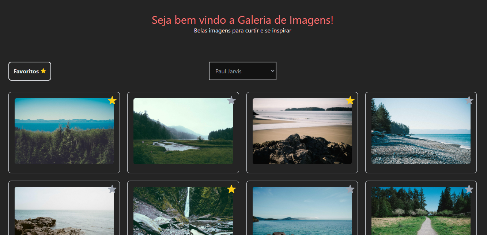
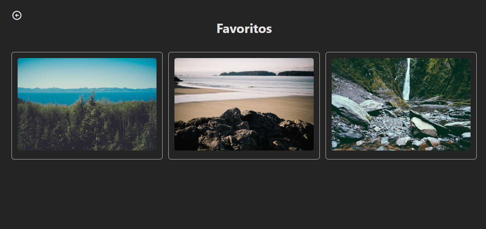

# Galeria de Imagens

Projeto Galeria de imagens, desafio de montar uma galeria de imagens responsiva, buscando dados de uma api de imagens e algumas features como favoritos, detalhes tas imagens e etc... 

## Referência

 - [Icones, utilizados através de CDN](https://boxicons.com/)


## Documentação da API

#### Retorna todos os itens

```http
  https://picsum.photos/v2/list
```

| Parâmetro   | Tipo       | Descrição                           |
| :---------- | :--------- | :---------------------------------- |
| `url` | `string` | Realizar fetch no endpoint, não é necessário autenticação |


## Autores

- [Eder Lima](https://www.github.com/EderLimaDev)


## Screenshot





## Stack utilizada

**Front-end:** React, TailwindCSS


## Licença

[MIT](https://choosealicense.com/licenses/mit/)

